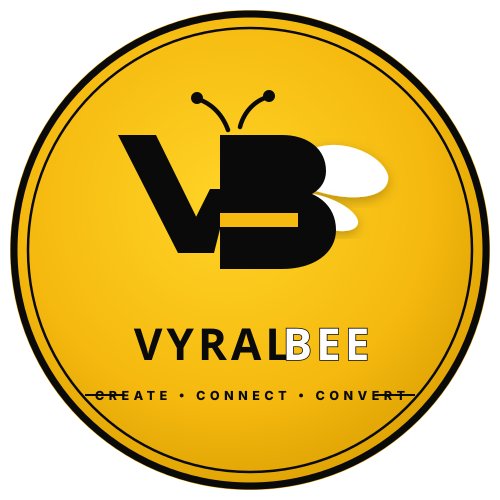

# 🐝 Vyral Bee — Production Marketing Website

> **"We Make Brands Visible."**  
> *CREATE • CONNECT • CONVERT*

A modern, high-converting, 3D-animated marketing website for **Vyral Bee** — a creative digital marketing agency combining brand strategy, cinematic video production, performance advertising, and modern web architecture.



---

## 🌟 Key Features

- **Brand Identity & Typography**:
  - Distinct display typography pairing (**Bricolage Grotesque**, **Space Grotesk**, **Inter**, **JetBrains Mono**).
  - High-resolution SVG brand badge (`public/logo.svg` & `public/favicon.svg`).
  - Warm gold (`#F5B90F`), deep obsidian (`#070707`), and clean contrast hierarchy.

- **3D Interactive Centerpiece**:
  - Three.js / WebGL abstract geometric sculpture with graphite/black-chrome finish and warm gold rim lighting.
  - Idle subtle rotation, cursor parallax response, and scroll-linked depth.

- **Interactive Capabilities & Demos**:
  - **Focus-Dimming Services Grid**: 6 core capabilities with large index numbering and hover illumination.
  - **Service Deep-Dives**: Detailed checklists for Social Media Management and Websites & Paid Advertising.
  - **6-Step Process Flow**: Interactive milestone progression from *Discover* to *Optimize*.
  - **Interactive Before → After Drag Slider**: Visual comparison of generic templates vs bespoke studio creative suite.
  - **Portfolio Showcase with Lightbox**: Categorized gallery with smooth zoom and modal project specs.
  - **Pricing & Packages Matrix**: 3-tier comparison with pre-fill quote triggers.
  - **Validated Studio Contact Form**: Client-side validated brief submission and direct WhatsApp click-to-chat.

---

## 🛠️ Tech Stack

- **Framework**: React 18 + Vite + TypeScript
- **Styling**: Tailwind CSS v4 + Custom Utilities
- **Motion & Animation**: Framer Motion
- **3D Graphics**: Three.js
- **Icons**: Lucide React
- **Celebration Effects**: Canvas Confetti

---

## 🚀 Quick Start

### 1. Install Dependencies
```bash
npm install
```

### 2. Start Development Server
```bash
npm run dev
```
Open [http://localhost:5173/](http://localhost:5173/) in your browser.

### 3. Build for Production
```bash
npm run build
```

---

## 📁 Project Structure

```
├── public/
│   ├── favicon.svg          # Crisp brand badge icon
│   └── logo.svg             # High-resolution vector logo
├── src/
│   ├── components/
│   │   ├── About.tsx            # Agency manifesto & stats grid
│   │   ├── BeforeAfterSlider.tsx# Interactive drag comparison slider
│   │   ├── Contact.tsx          # Validated inquiry form & WhatsApp
│   │   ├── CtaBanner.tsx        # High-impact closing banner
│   │   ├── Footer.tsx           # Studio footer & social links
│   │   ├── Hero.tsx             # Hero section with kinetic typography
│   │   ├── Hero3D.tsx           # 3D Three.js geometric sculpture
│   │   ├── Industries.tsx       # 8 target sector cards
│   │   ├── Logo.tsx             # Brand badge component
│   │   ├── Navbar.tsx           # Sticky glassmorphic nav & mobile menu
│   │   ├── Portfolio.tsx        # Work gallery & Lightbox modal
│   │   ├── PricingPackages.tsx  # 3-tier comparison matrix
│   │   ├── ProcessTimeline.tsx  # 6-step growth workflow
│   │   ├── ServiceDeepDives.tsx # Checklist deep-dives
│   │   ├── ServicesOverview.tsx # 6 core capability cards
│   │   └── WhyChooseUs.tsx      # 8 agency principles
│   ├── constants/
│   │   └── content.ts           # Centralized copy, constants & config
│   ├── App.tsx                  # Master application layout
│   ├── index.css                # Design tokens, fonts, and utilities
│   └── main.tsx                 # Application entry point
├── package.json
├── tsconfig.json
└── vite.config.ts
```

---

## 📄 License & Copyright

© 2026 **Vyral Bee**. All rights reserved.  
*CREATE • CONNECT • CONVERT*
